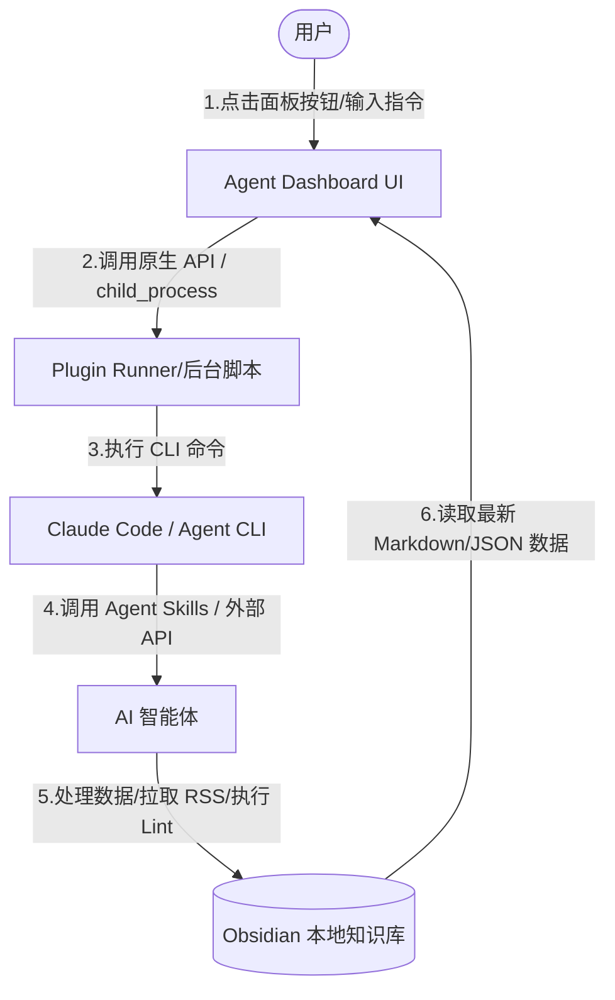

[[视频自动化生成]]
这是一份根据视频内容整理的详细技术方案与操作指南。本指南旨在将视频中展示的 **基于 AI 智能体（Agent）驱动的 Obsidian 仪表盘（Dashboard）** 的构建思路、实现原理以及具体开发步骤进行系统化整理，并采用 Obsidian 友好的 Markdown 语法（包括 Callouts、代码块及 Mermaid 图示）进行排版，便于您在自己的 Obsidian 库中直接保存和阅读。

---

# 📖 AI 智能体驱动的 Obsidian 仪表盘构建指南

传统的 Obsidian 仪表盘通常基于 Markdown 页面，配合 `Dataview` / `DataviewJS` 及 `Templater` 插件来查询和展示本地笔记数据。然而，在 AI 时代，这种静态的、只读的仪表盘无法与 AI 智能体（Agent）进行深度交互。

本指南介绍了一种全新的方案：**利用 AI 开发工具（如 Claude Code、CodeX 或本地运行的大模型），通过简单的提示词（Prompt）直接生成一个原生的 Obsidian 仪表盘插件**。该仪表盘不仅能全面替代传统 DataviewJS 的展示功能，更能作为 AI 智能体的“控制台”，实现一键运行脚本、一键调用 Agent 技能、一键处理外部数据等交互式操作。

---

## 🛠️ 1. 系统架构与工作流

该智能体仪表盘的核心原理是利用 Obsidian 插件的原生环境（Node.js / 浏览器 API），通过子进程或 API 直接与底层的命令行工具（如 `Claude Code` CLI 或自定义 Python/Node 脚本）进行通信。

### 🔄 数据与交互流向


---

## 📂 2. 环境初始化与依赖准备

构建该仪表盘的第一步是初始化一个标准的 Obsidian 插件开发环境。您无需具备深厚的 TypeScript 开发经验，整个过程将由 AI 智能体（如 CodeX 或 Claude Code）协助完成。

### 📌 步骤 1：创建本地项目
在电脑本地创建一个空白文件夹，并在您的 AI 开发工具（例如 CodeX 或配置了 `Claude Code` 的终端）中打开该文件夹。

### 📌 步骤 2：拉取官方插件模板并初始化
向 AI 智能体发送指令，让其自动拉取 Obsidian 官方的插件示例仓库，并安装基础依赖：

> [!NOTE] 提示词示例（环境初始化）
> “请在当前目录下克隆 Obsidian 官方的 sample plugin 仓库 (https://github.com/obsidianmd/obsidian-sample-plugin)。
> 克隆完成后，请在该目录下执行 `npm install`。
> 随后，请在该项目中安装并配置以下两个 Skill（或指定 Agent 能力）：
> 1. Anthropic 官方的 `front-end-design` Skill（用于生成 UI 界面与样式）。
> 2. `obsidian-plugin-dev` 开发 Skill。
> 最后，完成初始化后执行 `npm run build` 确保项目可以正常编译。”

### 📌 步骤 3：项目配置文件结构
编译通过后，项目结构通常如下，Obsidian 插件本质上只需要这三个核心文件：

```
agent-dashboard/ (项目根目录)
├── main.ts            # 插件的核心逻辑代码 (TypeScript)
├── styles.css         # 样式文件 (CSS)
├── manifest.json      # 插件元数据声明文件 (JSON)
├── package.json       # 项目依赖与脚本配置
└── AGENTS.md / CLAUDE.md # 记录项目规则与 Agent 交互规范的 Markdown 文件
```

---

## 🎨 3. UI 原型设计（前端设计）

拥有环境后，第二步是设计仪表盘的外观。这里利用了 Anthropic 发布的 `front-end-design` 技能。

### 💡 方案 A：通过提示词直接生成 UI
您可以使用以下结构化的提示词，让 AI 智能体在 `prototype` 文件夹下生成一个包含 HTML/CSS/JS 的静态 UI 页面：

> [!TIP] 提示词示例（生成 UI 原型）
> “请使用 `front-end-design` 技能设计一个名为 **Jason's Agent Dashboard** 的 UI 原型。
> 页面应包含以下四个 Tab 选项卡，并且整体风格采用暗黑科技风（可提供多种配色方案切换，如 Ember Console、Aurora Dark 等）：
> 1. **OVERVIEW（概览）**:
>    - 展示 Token 消耗指标（Token Plan Burn）、收件箱积压情况（Inbox Backlog）和任务完成率（Task Flow）。
>    - 包含一个类似 GitHub Contribution 的“笔记创建热力图”（Vault Note Creation Heatmap），展示过去 365 天内每天新建笔记的数量（分4个颜色档位）。
> 2. **TODAY（今日）**:
>    - 包含一个用于快速捕捉想法的输入框（Idea Capture）。
>    - 展示今日任务清单（带有 Todo 状态及进度条）。
> 3. **VAULT（知识库状态）**:
>    - 展示知识库健康评分（Vault Health Score）、双链完整度（Link Integrity，包含断链与孤立笔记比例）以及元数据覆盖率（Metadata Coverage）。
> 4. **PULSE（动态/外部信息）**:
>    - 包含一组交互按钮：Deep Research、Pull RSS Feeds、Reddit Feeds、Inbox Ingest、Vault Lint。
>    - 展示研究漏斗数据、信息源占比图表及 Hacker News、YouTube 等外部平台的最新资讯列表。
>
> 请将所有生成的文件（HTML, CSS, JS）保存在本地的 `prototype/simple-dashboard/` 文件夹下。”

### 📸 方案 B：通过截图反向生成（Image-to-UI）
如果您在网上看到喜欢的仪表盘设计，可以使用 `image2-to-ui` 技能，直接上传截图，AI 智能体会自动进行 1:1 的像素级像素还原，输出对应的 HTML 和 CSS 样式。

---

## ⚙️ 4. 编写 Obsidian 插件逻辑

原型设计满意后，需要将静态页面转化为真正的 Obsidian 插件代码，使其能够调用 Obsidian API。

### 📌 步骤 1：将 UI 代码整合至 `main.ts`
让 AI 智能体读取 `prototype` 目录下的静态页面，并将其改写为 TypeScript 格式，接入 Obsidian 视图类（`ItemView`）：

```typescript
// 示例：在 main.ts 中注册并渲染 Dashboard 视图（简化逻辑示意）
import { ItemView, WorkspaceLeaf } from 'obsidian';

export const VIEW_TYPE_AGENT_DASHBOARD = "agent-dashboard-view";

export class AgentDashboardView extends ItemView {
    constructor(leaf: WorkspaceLeaf) {
        super(leaf);
    }

    getViewType() {
        return VIEW_TYPE_AGENT_DASHBOARD;
    }

    getDisplayText() {
        return "Agent Dashboard";
    }

    async onOpen() {
        const container = this.containerEl.children[1];
        container.empty();
        
        // 创建仪表盘容器
        const dashboardEl = container.createEl("div", { cls: "agent-dashboard-container" });
        
        // 渲染 HTML 结构（此部分由 AI 将原型中的 HTML 自动转换为 DOM 操作或 innerHTML）
        dashboardEl.innerHTML = `
            <div class="dashboard-header">
                <h1>JASON'S AGENT DASHBOARD</h1>
                <span class="live-indicator">LIVE</span>
            </div>
            <!-- 更多 Tab 结构与网格布局 -->
        `;
        
        // 初始化各个模块的数据加载逻辑
        this.loadVaultStats();
        this.renderHeatmap();
    }
}
```

### 📌 步骤 2：编译并部署到 Obsidian
在项目目录下执行：
```bash
npm run build
```
编译成功后，在您的 Obsidian 库中手动部署：
1. 打开您的 Obsidian 库文件夹，进入 `.obsidian/plugins/` 目录。
2. 新建一个名为 `agent-dashboard` 的文件夹。
3. 将项目根目录下的 `main.js`、`styles.css` 和 `manifest.json` 三个文件复制到该新建文件夹中。
4. 进入 Obsidian 设置 -> 第三方插件 -> 启用 **Agent Dashboard**。
5. 按下 `Ctrl/Cmd + P` 唤起命令面板，输入 `Agent Dashboard: Open Dashboard` 即可打开面板。

---

## 🛠️ 5. 核心功能模块的实现原理

### 📊 5.1 笔记创建热力图（Vault Note Creation Heatmap）
传统的 Dataview 渲染热力图速度较慢。而在插件中，我们可以直接通过原生 API 快速读取所有文件的创建时间：

```typescript
// 在插件逻辑中，通过 this.app.vault.getMarkdownFiles() 获取所有笔记
const files = this.app.vault.getMarkdownFiles();
const dateMap: { [key: string]: number } = {};

files.forEach(file => {
    // 获取文件的创建时间或修改时间
    const stat = file.stat;
    const dateStr = window.moment(stat.ctime).format("YYYY-MM-DD");
    dateMap[dateStr] = (dateMap[dateStr] || 0) + 1;
});

// 随后根据数量将日期渲染到 365 天网格中，并映射为 4 个颜色档位
// 档位定义：1篇笔记 (淡色) -> 2篇 (中度) -> 4篇 (较深) -> >4篇 (深色)
```

### 🔗 5.2 知识库健康度（Vault Health & Lint）
通过调用本地脚本，检测知识库内部的结构性问题，例如：
* **孤儿笔记（Orphan Notes）**：没有任何导入或导出链接的笔记。
* **断链（Broken Links）**：双链指向了不存在的文件。
* **元数据缺失**：Frontmatter 未格式化或缺少关键字段。
这些信息会在 **VAULT** Tab 页面上以图表形式直观呈现，并支持一键通过 Lint 脚本自动修复。

### 🤖 5.3 智能体交互：以 "Inbox Ingest" 为例
这是本仪表盘最强大的功能。通过在面板上点击 **Inbox Ingest** 按钮，触发后台脚本，对 `inbox` 目录下的外部临时文件进行 AI 处理。

```typescript
// 按钮点击事件绑定
ingestButton.addEventListener("click", () => {
    // 调用 Node.js 的 child_process 运行后台代理任务
    const { exec } = require('child_process');
    
    // 执行命令行指令，让 Claude 对收件箱内容进行翻译和提炼，并规范化为 Markdown 输出
    exec('claude exec "对 inbox 文件夹下的文件进行翻译和提炼，整理为中文 Markdown 笔记，并保存到知识库根目录下"', 
    (error, stdout, stderr) => {
        if (error) {
            console.error(`执行错误: ${error}`);
            return;
        }
        console.log(`Agent 输出: ${stdout}`);
        // 刷新 UI 界面
        this.refreshDashboard();
    });
});
```

> [!SUCCESS] 运行效果
> 视频中演示了：在 `inbox` 目录下存放了一篇 Google 官方关于 **Karpathy LLM Wiki** 概念延伸的英文博客文章（标准 Open Knowledge Format）。点击 **Inbox Ingest** 后，后台自动调用 `Claude Code` 进行翻译、提炼关键概念并提取结构化的 Frontmatter，在 Obsidian 根目录下自动生成了一篇排版完美的中文笔记。

### 🌐 5.4 外部信息源拉取（RSS & Reddit & API）
利用面板上的 **Pull RSS Feeds** 按钮，可以绕过 Obsidian 本身对沙盒环境的某些网络限制，直接通过底层 Node.js 环境使用 `rss-parser` 库或直接请求外部 API（如 GitHub API、Reddit API、Hacker News API）。拉取的数据将缓存在本地的 JSON 文件中，并通过仪表盘的 **PULSE** 页面进行美观的渲染展示。

---

## 💡 6. 总结：AI 时代的“活体知识库”（LLM Wiki）

视频最后提到了 Andrej Karpathy 提出的 **LLM Wiki（或活体知识库）** 概念。

> [!INFO] Open Knowledge Format (开放知识格式)
> 谷歌等主流技术圈目前正在积极跟进并推广这一理念。未来的知识库不再只是供人类阅读的静态文档，而是**由 AI 智能体全面接管并高频读写的结构化数据库**。
>
> 规范化的 Markdown 格式（统一的 Frontmatter、清晰的双向链接、标准化的标签体系）成为了大语言模型（LLM）最完美的存储介质。而本案中构建的 **Agent Dashboard**，则是人与 AI 在这个知识库中共同协作的控制台。

建议您从最基础的 UI 框架开始搭建，然后根据日常的学习和工作流，逐步让 AI 为您的仪表盘添加自定义的按钮和数据模块。