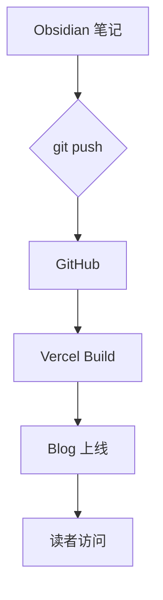
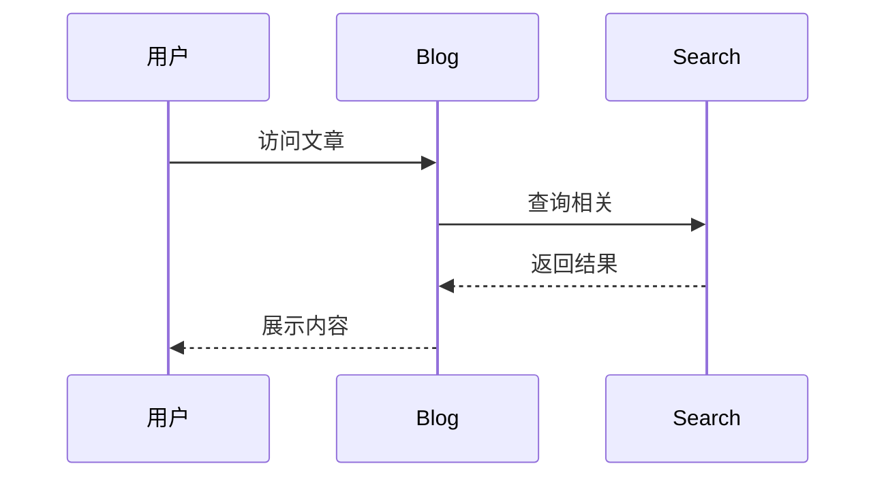

> [!abstract] 本文目的
> 本文涵盖 Obsidian 支持的所有主要 Markdown 扩展语法，用于验证 Blog 渲染管线是否正确处理每种格式。

---
测试文本
## 一、基础排版

### 文本样式

这是**粗体**，这是*斜体*，这是***粗斜体***，这是~~删除线~~，这是==高亮文本==，这是`行内代码`。

组合测试：**==粗体+高亮==**，*~~斜体+删除线~~*。

### 引用与嵌套

> 一级引用：知识就是力量。
> — 弗朗西斯·培根

> [!quote] 嵌套引用
> > 内层引用内容
> 
> 外层继续

---

## 二、Obsidian Callouts

> [!note] Note 类型
> 这是普通笔记 callout。

> [!tip] Tip 类型
> 这是提示 callout，通常用于建议。

> [!warning] Warning 类型
> 这是警告 callout。

> [!info] Info 类型
> 这是信息 callout。

> [!example] Example 类型
> 这是示例 callout。

> [!bug] Bug 类型
> 这里有一个 Bug 需要修复。

> [!quote] Quote 类型
> 人生苦短，我用 Python。

> [!fail] Fail 类型
> 这个方案不可行。

> [!success] Success 类型
> 测试全部通过！

> [!question] Question 类型
> 这样做真的对吗？

> [!abstract]- 可折叠 Callout（默认收起）
> 这段内容默认是隐藏的，点击展开。
> 用于放置补充说明或剧透内容。

> [!tip]+ 可折叠 Callout（默认展开）
> 这段内容默认展开，可以收起。

---

## 三、WikiLink 双链

- 普通链接：[[AI对话的四象限模型]]
- 带别名：[[AI对话的四象限模型|四象限模型]]
- 带锚点：[[AI对话的四象限模型#一、 AI对话的四象限模型]]
- 不存在的页面（空链）：[[这个页面不存在]]
- 外部链接：[GitHub](https://github.com)

---

## 四、标签

行内标签：#测试 #Obsidian #Blog

---

## 五、代码

### 行内代码

使用 `obsidian_read()` 读取笔记内容。

### 代码块

```python
# Python 示例
def fibonacci(n: int) -> list[int]:
    """生成斐波那契数列"""
    seq = [0, 1]
    for i in range(2, n):
        seq.append(seq[i-1] + seq[i-2])
    return seq

print(fibonacci(10))
```

```typescript
// TypeScript 示例
interface WikiPage {
  title: string;
  tags: string[];
  content: string;
  createdAt: Date;
}

const page: WikiPage = {
  title: "测试页面",
  tags: ["test", "obsidian"],
  content: "# Hello",
  createdAt: new Date(),
};
```

```sql
SELECT p.title, COUNT(bl.source) AS backlink_count
FROM pages p
LEFT JOIN backlinks bl ON p.path = bl.target
GROUP BY p.title
ORDER BY backlink_count DESC
LIMIT 10;
```

---

## 六、表格

| 语法 | Obsidian | Blog 渲染 | 说明 |
|------|:--------:|:---------:|------|
| 粗体 | ✅ | ? | `**text**` |
| Callout | ✅ | ? | `> [!type]` |
| WikiLink | ✅ | ? | `[[page]]` |
| 数学公式 | ✅ | ? | `$E=mc^2$` |
| Mermaid | ✅ | ? | 流程图 |
| 脚注 | ✅ | ? | `[^1]` |

---

## 七、数学公式（LaTeX）

行内公式：$E = mc^2$，以及 $\sum_{i=1}^{n} i = \frac{n(n+1)}{2}$。

块级公式：

$$
\int_{-\infty}^{\infty} e^{-x^2} dx = \sqrt{\pi}
$$

$$
\mathbf{A} = \begin{pmatrix} a_{11} & a_{12} \\ a_{21} & a_{22} \end{pmatrix}
$$

---

## 八、脚注

这是一个带脚注的句子[^1]，还有另一个脚注[^2]。

[^1]: 第一个脚注的内容。这里可以写补充说明。
[^2]: 第二个脚注，支持 **Markdown** 格式。

---

## 九、任务列表

- [x] 搭建 Blog 框架
- [x] 配置 Obsidian 语法支持
- [ ] 测试 Callout 渲染
- [ ] 测试 WikiLink 渲染
- [ ] 测试数学公式渲染
- [ ] 部署上线

---

## 十、Mermaid 图表





---

## 十一、列表

### 无序列表

- 第一项
  - 嵌套 A
  - 嵌套 B
    - 更深层级
- 第二项
- 第三项

### 有序列表

1. 安装 Astro
2. 配置内容集合
3. 连接 Obsidian Vault
4. 部署到 Vercel

### 混合列表

1. 准备内容
   - 写 Markdown
   - 添加 frontmatter
2. 发布
   1. git add
   2. git commit
   3. git push
3. 验证
   - [ ] 检查页面
   - [ ] 检查链接

---

## 十二、水平线与分隔

上方内容

---

下方内容

---

## 十三、HTML 嵌入

<details>
<summary>点击展开详情</summary>

这是 `<details>` 标签内的内容，支持 **Markdown** 格式。

| 项目 | 值 |
|------|-----|
| 状态 | 已展开 |
| 格式 | Markdown |

</details>

<kbd>Ctrl</kbd> + <kbd>C</kbd> 复制，<kbd>Ctrl</kbd> + <kbd>V</kbd> 粘贴。

---

## 十四、图片测试

<!-- 使用占位图测试 -->


---

## 十五、综合压力测试

> [!tip] 混合语法测试
> 在 callout 中使用 **粗体**、*斜体*、`代码`、[[WikiLink]]、$E=mc^2$、[^mixed-note]。

[^mixed-note]: 这是混合语法测试的脚注。

一段包含所有内联样式的文字：**粗体** *斜体* ~~删除~~ ==高亮== `代码` $公式$ #标签 [外链](https://example.com)。

---

> [!warning] 渲染检查清单
> 1. Callout 是否正确显示带颜色图标？
> 2. WikiLink 是否解析为有效链接？
> 3. 数学公式是否正确渲染？
> 4. Mermaid 图表是否可视化？
> 5. 脚注是否在文末正确展示？
> 6. 任务列表是否可交互？
> 7. 可折叠 callout 是否可展开/收起？
> 8. 高亮文本 `==text==` 是否有背景色？
